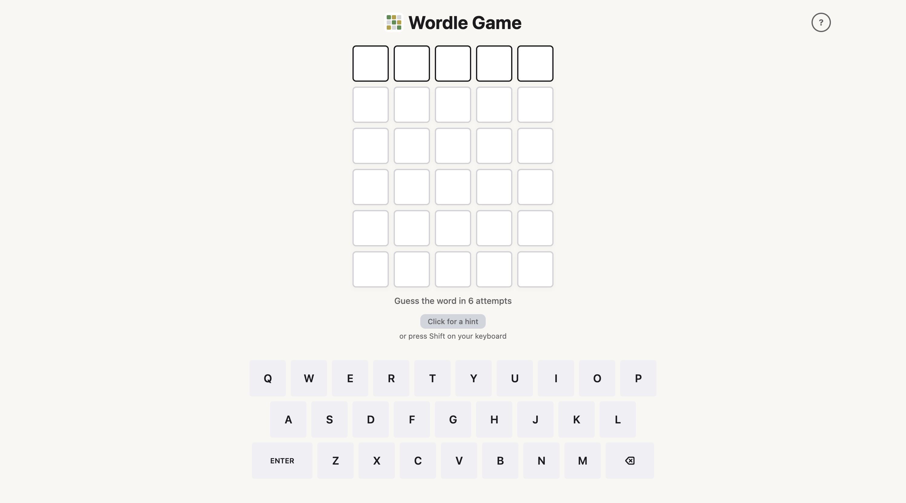

# Wordle Game

A fully playable Wordle clone built with React 19, TypeScript, and Tailwind CSS v4. Deployed to GitHub Pages.

**Live Demo:** https://CesarSG.github.io/WordleGame/



---

## Features

- **Game logic** — 6-guess limit, letter state tracking (correct / present / absent), and win/loss detection
- **Color-coded feedback** — tiles and on-screen keyboard update in sync after each guess
- **Hint system** — optional per-word hints to help players when stuck
- **Confetti celebration** — animated confetti on a correct guess
- **Toast notifications** — non-blocking feedback for invalid words, win, and loss states
- **Instructions modal** — in-game help with rules and keyboard shortcuts
- **Physical keyboard support** — type with your keyboard or use the on-screen one
- **Responsive layout** — works on desktop and mobile

## Tech Stack

| Layer | Technology |
|---|---|
| UI framework | React 19 |
| Language | TypeScript |
| Styling | Tailwind CSS v4 |
| Build tool | Vite |
| Deployment | GitHub Pages via `gh-pages` |
| Notifications | Sonner |
| Confetti | @hiseb/confetti |

## Getting Started

```bash
npm install
npm run dev
```

Open [http://localhost:5173](http://localhost:5173) in your browser.

### Other commands

```bash
npm run build    # Production build
npm run preview  # Preview the production build locally
npm run lint     # Run ESLint
npm run deploy   # Build and deploy to GitHub Pages
```

## Project Structure

```
src/
├── components/
│   ├── Board.tsx            # Game grid and tile rendering
│   ├── Keyboard.tsx         # On-screen keyboard with letter state sync
│   └── InstructionsModal.tsx
├── utils/
│   ├── confetti.ts          # Confetti trigger helper
│   └── toasts.tsx           # Toast notification helpers
├── data/
│   └── words.ts             # Word list with optional hints
├── constants.ts             # Game configuration (word length, max guesses)
├── types.ts                 # Shared TypeScript types
└── App.tsx                  # Core game state and logic
```

## License

[MIT](LICENSE)
